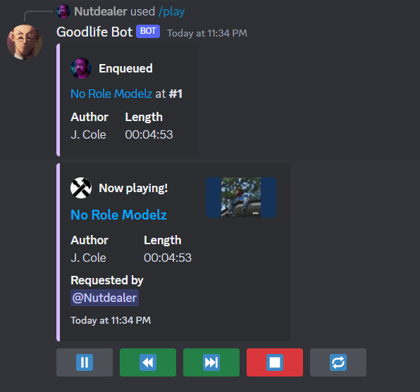

# A Lavalink based, discord music bot

This is the code for my personal use bot that I made so me and my friends can listen to music on discord with no hassles.
I leave the code here so anybody that wants to use it as a template is free to do so.

# [Test it out](https://discord.com/api/oauth2/authorize?client_id=709471193043959883&permissions=36857856&scope=bot%20applications.commands)



## Running it yourself

To actually run the bot you first need a config.json file in the root directory, in the the following format
```js
{
  "token": "Your token here",
  "clientID" : "Your client ID here",
  "guildID" : "Your own private test guild ID",
  "nodes" : [
    {
      "id" : "1",
      "hostname": "Some host(can be localhost)",
      "password" : "somepassword",
      "port" : 2333
    }
  ],
  "embedColor" : [255,255,255],
  "waitAmount": 1234 
}
```

All the values are different depending on how you want them and must be in line with your lavalink config

Next you need to run a [lavalink](https://github.com/lavalink-devs/Lavalink) server for the bot to connect to, make sure that your ```application.yaml``` file is setup properly

All thats left is to start npm, run ```npm install``` and ```npm run bot``` and everything should start up. 

## Packages and technologies used
 
 - [Node-js](https://nodejs.org/en)

 - [Discord-js v14](https://discord.js.org/)

 - [Lavalink](https://github.com/lavalink-devs/Lavalink)

 - [Vulkava](https://vulkava.js.org/) for Lavalink wrapper


